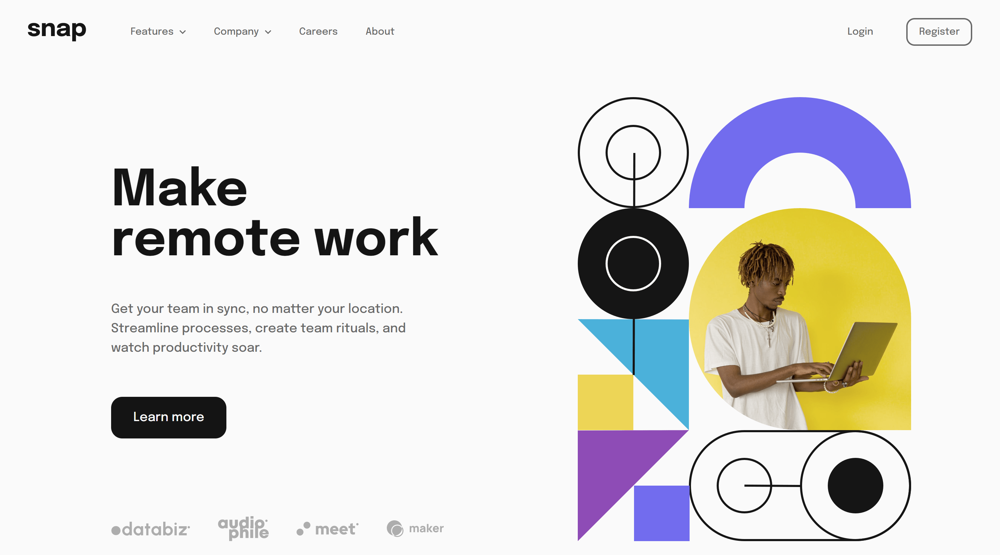

# Frontend Mentor - Snap Intro Solution

This is a solution to the [Intro section with dropdown navigation challenge on Frontend Mentor](https://www.frontendmentor.io/challenges/intro-section-with-dropdown-navigation-ryaPetHE5). Frontend Mentor challenges help you improve your coding skills by building realistic projects. 

## Table of contents

- [Overview](#overview)
  - [The challenge](#the-challenge)
  - [Screenshot](#screenshot)
  - [Links](#links)
- [My process](#my-process)
  - [Built with](#built-with)
  - [What I learned](#what-i-learned)
  - [Continued development](#continued-development)
- [Author](#author)

## Overview

### The challenge

Users should be able to:

- View the relevant dropdown menus on desktop and mobile when interacting with the navigation links
- View the optimal layout for the content depending on their device's screen size
- See hover states for all interactive elements on the page

### Screenshot



### Links

- Solution URL: [GitHub Repo](https://github.com/waldosmuts/snap-intro-section)
- Live Site URL: [Live Preview](https://snap-intro.netlify.app/)

## My process

### Built with

- Semantic HTML5 markup
- Flexbox
- CSS Grid
- Mobile-first workflow
- [React](https://reactjs.org/) - JS library
- [Tailwind](https://tailwindcss.com/) - CSS framework

### What I learned

Dropdown menus and nav-links using React state

```js
const [showNav, setShowNav] = useState(false)
const [featuresExpanded, setFeaturesExpanded] = useState(false)
const [companyExpanded, setCompanyExpanded] = useState(false)
```

### Continued development

I want to continue build apps with React, big and small to get the needed experience.

## Author

- Portfolio - [Waldo Smuts](https://waldosmuts.netlify.app)
- Frontend Mentor - [@waldosmuts](https://www.frontendmentor.io/profile/waldosmuts)